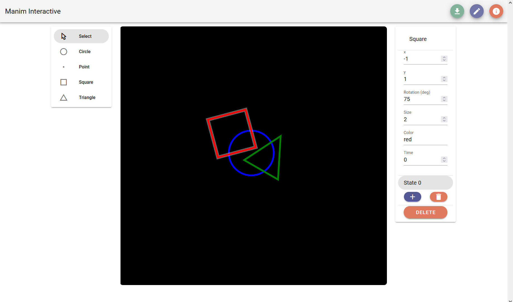
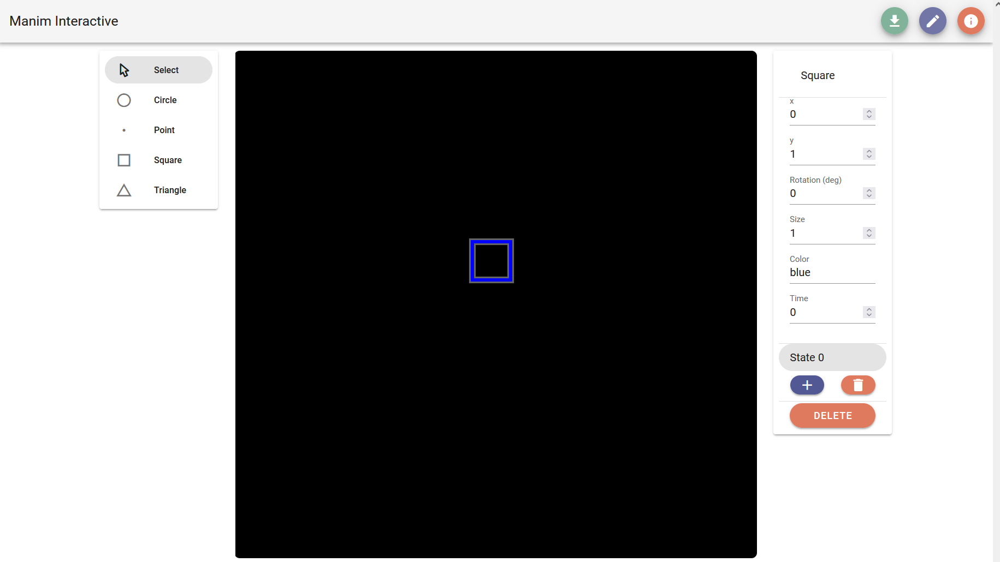
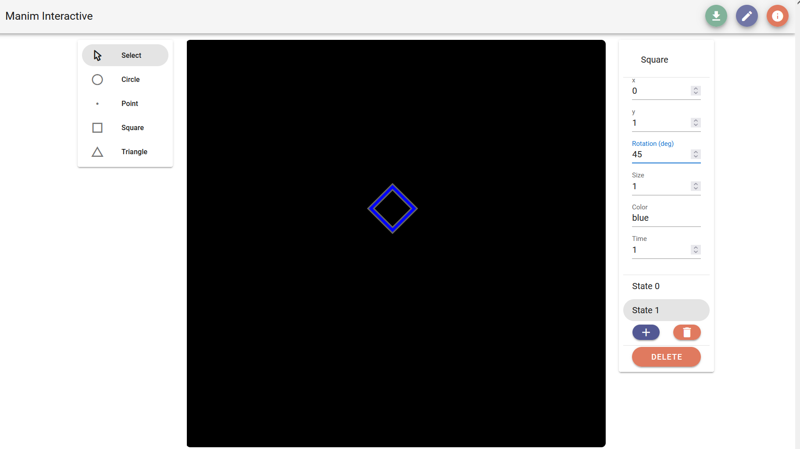
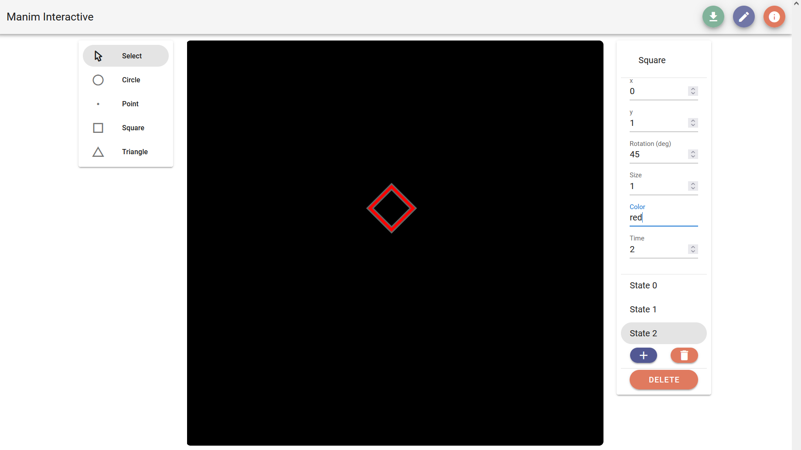
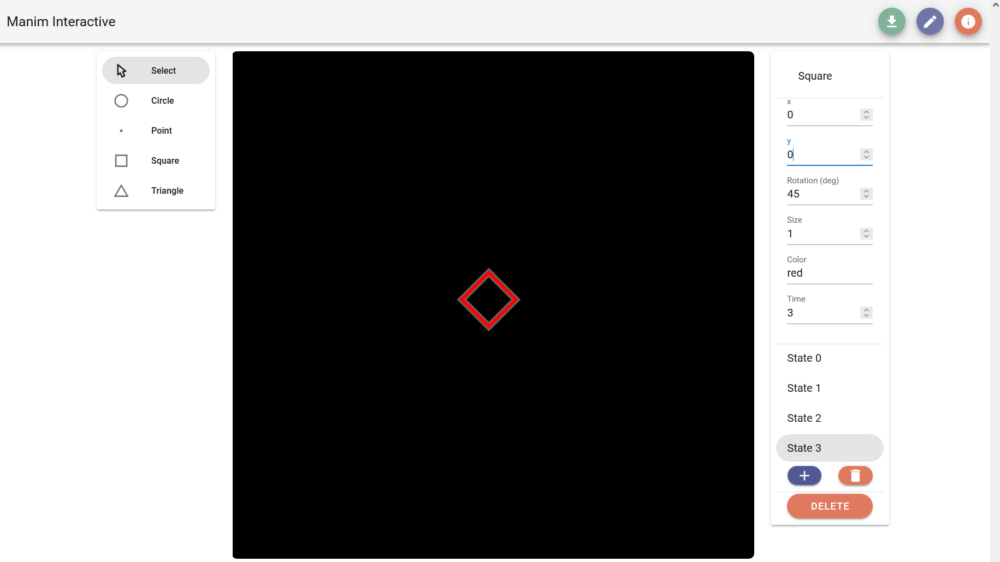
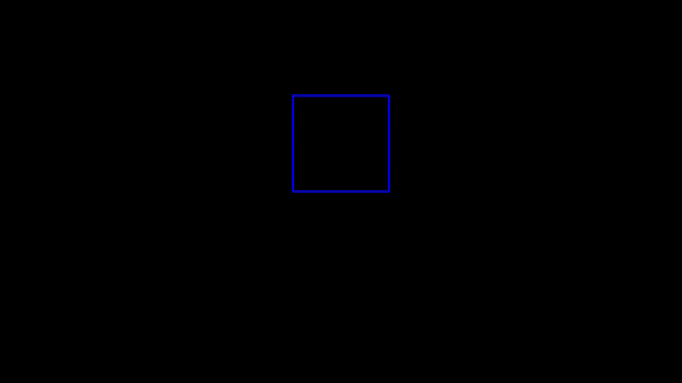
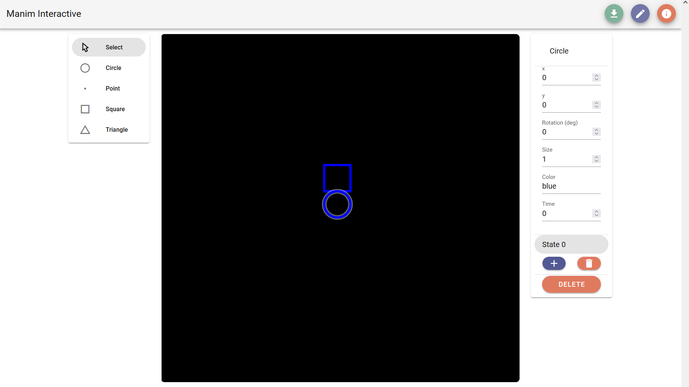
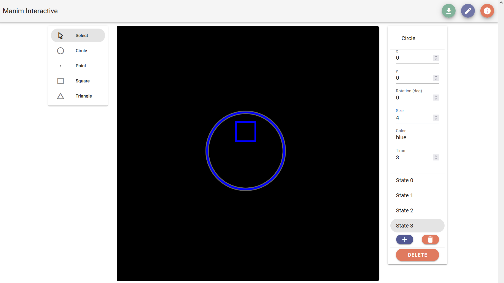
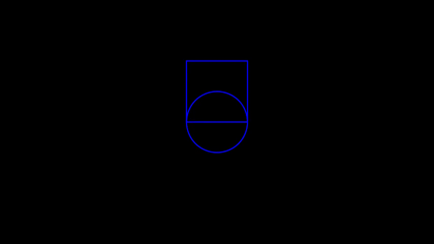

# Manim Interactive

## About
Manim Interactive is a web-based application that serves as a graphical user interface to the [Manim](https://www.manim.community/) library. The interface is targeted at mathematics teachers and students who wish to create mathematical animations like those that can be made with Manim but who do not have familiarity with Python or would prefer not to work directly with a Python library to create such animations. 


## Usage guide

The central area of the application shows a _scene_ view that models a Manim ``Scene`` that contains objects that can be animated. 

The panel on the left is the _object selection menu_. By selecting an object from this menu, users can directly add a corresponding object to the scene by clicking anywhere in the _scene_. 

The added object is automatically selected as the current object, which causes the _object state menu_ to appear in the right panel. 
The _object state menu_ allows users to specify position, rotation, size, and color for the current object. 

Each state for an object occurs at a specified time (in seconds) in the course of the final rendered animation video, and this time can be modified in the _object state menu_.

Additional states can be added to an object by clicking the "Add state" button, which automatically adds a new state that begins one second after the currently selected state for the current object.

Object states can be removed from an object by selecting the "Delete state" button on the selected state in the _object state menu_, and entire objects can be removed by clicking the "Delete object" button. 

Once an animation is composed in the _scene_, the "Download" button produces a rendered video of the scene as an ``mp4`` file.  

Additional instructions and example scenes are shown on the About page, which can be accessed by clicking the "About" button in the top right corner of the application. 

### Example - Square
Add a square to the scene at (0,1). 


Add a new state to the square object and set the rotation in the state to 45 degrees. 


Add a new state to the square object and set the color in the state to red. 


Add a new state to the square object and set the position to (0,0). 


Click the download button to render the scene. The final scene will look like this: 


### Example - Circle and Square
Multiple objects can exist in a scene simultaneously. Add a circle at (0,0) to the scene above. 


Add three new states to the circle so that it exists as long as the square does. Leave states 0-2 as they are, and change state 3 so the size of the object is 4.  


Click the download button to render the scene. The final scene will look like this: 


## Running your own build
To run your own build of Manim Intereactive, download the [source code](https://github.com/awtotty/manimi) and install the necessary dependencies from the root directory with ``npm``. 
```
npm install
```
To run a hot-reload development server, run
```
npm run serve
```
To run a minified build for production, run
```
npm run build
```

## Attribution
The Manim Community logo is courtesy of [Manim Commmunity](https://github.com/ManimCommunity/manim-website) under [Creative Commons Attribution-ShareAlike 3.0 Unported License](https://creativecommons.org/licenses/by-sa/3.0/). 
